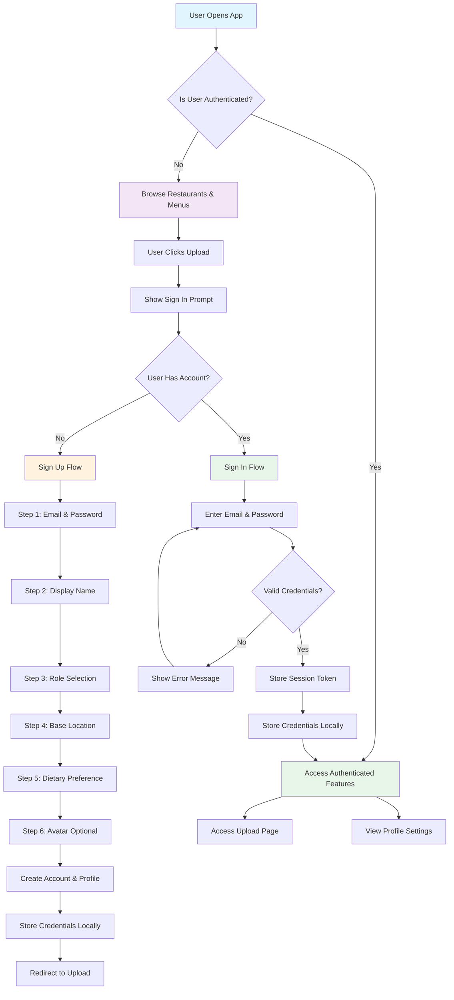

# Authentication Flow Architecture for Foodosys

## Overview

This document outlines the authentication flow architecture for the foodosys project, designed to provide a seamless user experience where users can browse the app without authentication, but are prompted to sign up/sign in when they want to upload photos.

## Authentication Flow Diagram



## Component Architecture

### 1. Authentication Components

```
src/app/auth/
├── page.tsx (Main auth page - replaces existing)
├── components/
│   ├── AuthFlow.tsx (Main flow controller)
│   ├── SignInForm.tsx (Sign in step)
│   ├── SignUpSteps/
│   │   ├── Step1Email.tsx
│   │   ├── Step2Name.tsx
│   │   ├── Step3Role.tsx
│   │   ├── Step4Location.tsx
│   │   ├── Step5Diet.tsx
│   │   └── Step6Avatar.tsx
│   └── ProgressIndicator.tsx
└── hooks/
    ├── useAuthFlow.ts (Flow state management)
    └── useLocalStorage.ts (Secure storage)
```

### 2. Context and State Management

```
src/contexts/
└── AuthContext.tsx (Global auth state)

src/hooks/
├── useAuth.ts (Auth state access)
├── useLocalStorage.ts (Secure local storage)
└── useSupabaseAuth.ts (Supabase integration)

src/lib/
├── auth.ts (Enhanced with new functions)
├── storage.ts (Secure storage utilities)
└── validation.ts (Form validation)
```

### 3. Integration Points

#### BottomNav Component Updates
- Detect authentication state from AuthContext
- Show "Scan" button for authenticated users
- Show "Sign In" button for unauthenticated users
- Display user email when authenticated
- Handle sign out functionality

#### Upload Page Integration
- Check authentication state on mount
- Redirect to auth if not authenticated
- Pass user context to upload components

#### Layout Integration
- Wrap app with AuthContext provider
- Handle authentication state persistence
- Manage loading states during auth checks

## Local Storage Strategy

### Secure Credential Storage

```typescript
interface StoredCredentials {
  email: string
  hashedPassword: string
  rememberMe: boolean
  timestamp: number
}

interface AuthStorage {
  sessionToken?: string
  user?: AuthUser
  credentials?: StoredCredentials
}
```

### Security Implementation

1. **Password Hashing**: Use bcrypt-like hashing for stored passwords
2. **Token Management**: Store only session tokens, not full user objects
3. **Expiration**: Implement credential expiration (30 days)
4. **Encryption**: Encrypt sensitive data before localStorage storage

### Storage Functions

```typescript
// Secure storage utilities
const secureStorage = {
  set: (key: string, value: any) => {
    const encrypted = encrypt(JSON.stringify(value))
    localStorage.setItem(key, encrypted)
  },
  
  get: (key: string) => {
    const encrypted = localStorage.getItem(key)
    return encrypted ? JSON.parse(decrypt(encrypted)) : null
  },
  
  remove: (key: string) => {
    localStorage.removeItem(key)
  }
}
```

## State Management Approach

### AuthContext Structure

```typescript
interface AuthState {
  isAuthenticated: boolean
  user: AuthUser | null
  isLoading: boolean
  error: string | null
  isOnboarding: boolean
  currentStep: number
}

interface AuthContextType {
  state: AuthState
  actions: {
    signIn: (email: string, password: string) => Promise<void>
    signUp: (userData: SignUpData) => Promise<void>
    signOut: () => void
    updateStep: (step: number) => void
    clearError: () => void
  }
}
```

### State Flow

1. **App Initialization**: Check for stored session/credentials
2. **Authentication Check**: Validate stored data with Supabase
3. **State Updates**: Update global auth state accordingly
4. **Component Re-render**: Components respond to state changes

## Data Flow Documentation

### Sign Up Flow

1. **User Input**: Collect form data across multiple steps
2. **Validation**: Validate each step before progression
3. **Account Creation**: Call Supabase auth.signUp()
4. **Profile Creation**: Create user profile with additional fields
5. **Local Storage**: Store credentials securely (if remember me)
6. **State Update**: Update global auth state
7. **Redirect**: Navigate to intended destination

### Sign In Flow

1. **Credential Entry**: User enters email/password
2. **Local Check**: Check for stored credentials
3. **Authentication**: Call Supabase auth.signInWithPassword()
4. **Session Storage**: Store session token
5. **Local Storage**: Update stored credentials (if remember me)
6. **State Update**: Update global auth state
7. **Redirect**: Navigate to intended destination

### Sign Out Flow

1. **User Action**: Trigger sign out
2. **Supabase Call**: Call auth.signOut()
3. **Local Cleanup**: Clear stored credentials
4. **State Reset**: Reset global auth state
5. **Redirect**: Navigate to home page

## Error Handling Strategy

### Validation Errors

- **Real-time validation**: Validate each form field on blur/change
- **Step validation**: Prevent progression if current step invalid
- **Cross-field validation**: Check for password confirmation, etc.

### Authentication Errors

- **Network errors**: Retry mechanism with exponential backoff
- **Invalid credentials**: Clear error messages with recovery options
- **Session expired**: Automatic re-authentication with stored credentials
- **Rate limiting**: Handle Supabase rate limits gracefully

### UI Error States

- **Loading indicators**: Show progress during async operations
- **Error messages**: Clear, actionable error descriptions
- **Recovery options**: Password reset, account recovery links
- **Graceful degradation**: Continue browsing if auth fails

## Security Considerations

### Credential Storage

1. **Encryption**: AES-256 encryption for localStorage data
2. **Hashing**: bcrypt for password hashing
3. **Salting**: Unique salts for each password hash
4. **Expiration**: Automatic credential expiration

### Session Management

1. **Token refresh**: Automatic session token refresh
2. **Session validation**: Validate tokens on app load
3. **Secure storage**: Use httpOnly cookies when possible
4. **Logout cleanup**: Complete data cleanup on sign out

### Data Protection

1. **Input sanitization**: Sanitize all user inputs
2. **SQL injection prevention**: Use parameterized queries
3. **XSS protection**: Sanitize displayed user data
4. **CSRF protection**: Implement CSRF tokens

## Component Relationships

### Dependencies

```
AuthContext
├── BottomNav (consumes auth state)
├── UploadPage (consumes auth state)
├── AuthFlow (manages auth state)
├── SignInForm (updates auth state)
└── SignUpSteps (updates auth state)

useLocalStorage
├── AuthFlow (persists credentials)
├── AuthContext (persists session)
└── useAuth (accesses stored data)

useSupabaseAuth
├── AuthFlow (Supabase operations)
├── SignInForm (authentication)
└── SignUpSteps (account creation)
```

### Data Flow

1. **User Input** → **Form Components** → **Validation** → **Auth Actions**
2. **Auth Actions** → **Supabase Client** → **Response Handling**
3. **Response Handling** → **State Updates** → **Local Storage**
4. **State Updates** → **Component Re-render** → **UI Updates**

## Implementation Roadmap

### Phase 1: Foundation (Priority: High)
1. Set up AuthContext and state management
2. Create secure localStorage utilities
3. Implement basic sign in/sign up functionality
4. Update BottomNav component integration

### Phase 2: Onboarding Flow (Priority: High)
1. Create multi-step sign up components
2. Implement form validation
3. Add progress indicators
4. Connect to profile creation API

### Phase 3: Integration (Priority: Medium)
1. Update Upload page authentication check
2. Implement redirect handling
3. Add error boundaries and loading states
4. Create comprehensive error handling

### Phase 4: Security & Polish (Priority: Medium)
1. Implement credential encryption
2. Add session management
3. Create comprehensive validation
4. Add accessibility improvements

### Phase 5: Testing & Optimization (Priority: Low)
1. Write comprehensive tests
2. Performance optimization
3. Security audit
4. Documentation completion

## Technical Considerations

### Performance
- Lazy load auth components
- Optimize re-renders with useMemo/useCallback
- Implement efficient state updates
- Cache validation results

### Accessibility
- Keyboard navigation support
- Screen reader compatibility
- High contrast mode support
- Focus management

### Browser Compatibility
- Progressive enhancement for older browsers
- Fallbacks for localStorage limitations
- Cross-browser testing
- Mobile optimization

## Conclusion

This authentication architecture provides a secure, user-friendly authentication system that:
- Allows browsing without authentication
- Prompts authentication only when needed
- Provides comprehensive onboarding flow
- Maintains secure local storage
- Integrates seamlessly with existing components
- Implements robust error handling and security

The modular design allows for incremental implementation and testing, ensuring a stable and maintainable authentication system.