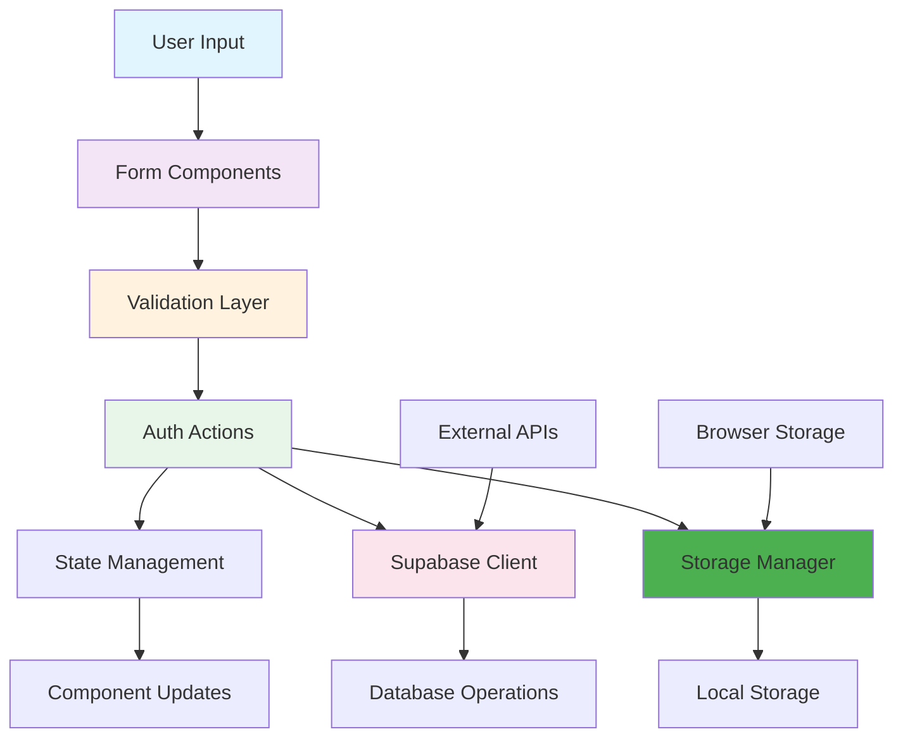
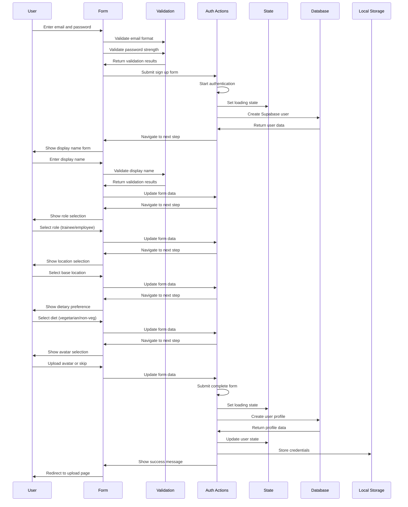
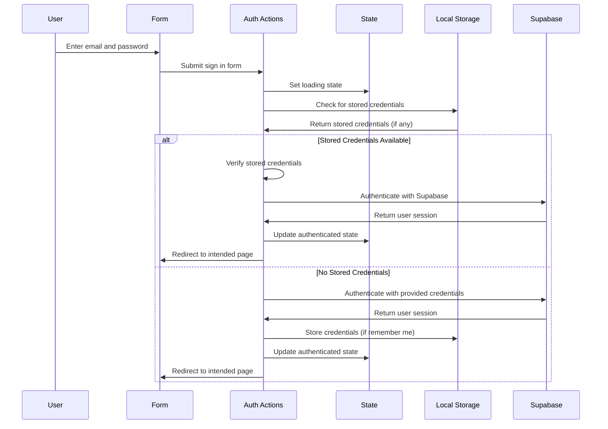
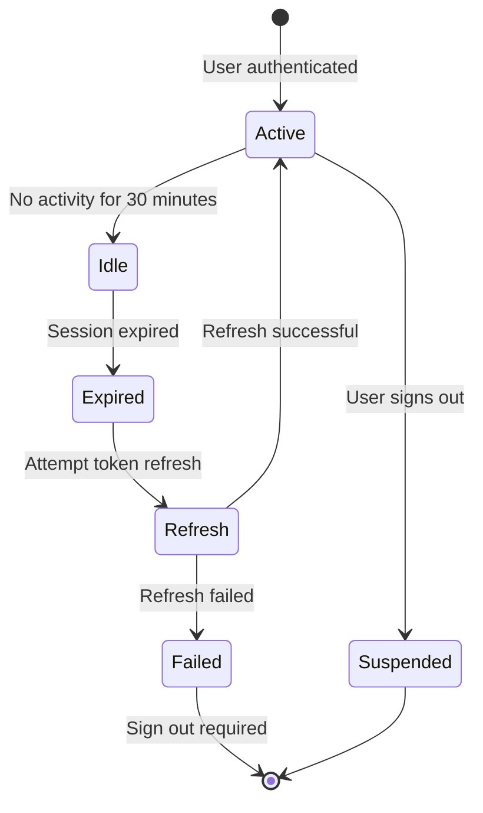
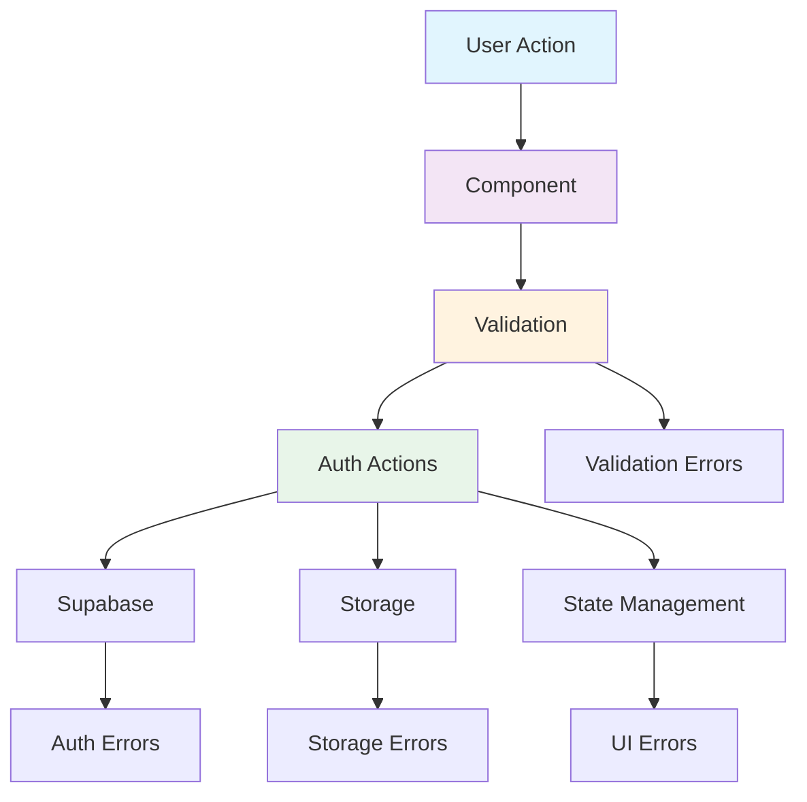

# Data Flow Documentation

## Overview

This document outlines the detailed data flow for the authentication system in foodosys, showing how data moves through components, APIs, and storage layers. The flow ensures secure, efficient, and maintainable data management.

## Data Flow Architecture



## 1. Sign Up Data Flow

### User Journey Flow



### Data Transformation Pipeline

```typescript
// Sign up data transformation pipeline
interface SignUpPipeline {
  input: UserFormData
  validation: ValidationResult[]
  sanitized: SanitizedData
  supabaseUser: SupabaseUser
  userProfile: UserProfile
  sessionData: SessionData
  storedCredentials: StoredCredentials
}

const processSignUp = async (formData: UserFormData): Promise<SignUpPipeline> => {
  // Stage 1: Input validation
  const validation = [
    validateEmail(formData.email),
    validatePassword(formData.password),
    validateDisplayName(formData.displayName),
    validateRole(formData.role),
    validateLocation(formData.baseLocation),
    validateDiet(formData.dietaryPreference)
  ]
  
  // Stage 2: Data sanitization
  const sanitized: SanitizedData = {
    email: sanitizeEmail(formData.email),
    password: formData.password, // Will be hashed
    displayName: sanitizeString(formData.displayName),
    role: formData.role,
    baseLocation: sanitizeString(formData.baseLocation),
    dietaryPreference: formData.dietaryPreference,
    avatarUrl: sanitizeUrl(formData.avatarUrl)
  }
  
  // Stage 3: Supabase user creation
  const { data: supabaseUser, error: authError } = await supabase.auth.signUp({
    email: sanitized.email,
    password: sanitized.password,
    options: {
      data: {
        display_name: sanitized.displayName,
        role: sanitized.role,
        base_location: sanitized.baseLocation,
        dietary_preference: sanitized.dietaryPreference,
        avatar_url: sanitized.avatarUrl
      }
    }
  })
  
  if (authError) throw new AuthError(authError.message)
  
  // Stage 4: Profile creation
  const { data: userProfile, error: profileError } = await createProfile(supabaseUser.id, {
    displayName: sanitized.displayName,
    avatarUrl: sanitized.avatarUrl,
    role: sanitized.role,
    baseLocation: sanitized.baseLocation,
    dietaryPreference: sanitized.dietaryPreference
  })
  
  if (profileError) throw new AuthError(profileError.message)
  
  // Stage 5: Session management
  const sessionData: SessionData = {
    token: supabaseUser.session.access_token,
    user: {
      id: supabaseUser.id,
      email: supabaseUser.email,
      displayName: sanitized.displayName,
      avatarUrl: sanitized.avatarUrl
    },
    expiresAt: Date.now() + (24 * 60 * 60 * 1000),
    isAuthenticated: true
  }
  
  // Stage 6: Local storage
  const storedCredentials: StoredCredentials = await hashCredentials(
    sanitized.email,
    sanitized.password
  )
  
  return {
    input: formData,
    validation,
    sanitized,
    supabaseUser,
    userProfile,
    sessionData,
    storedCredentials
  }
}
```

## 2. Sign In Data Flow

### User Journey Flow



### Credential Verification Flow

```typescript
// Sign in credential verification
const verifyCredentials = async (
  email: string,
  password: string
): Promise<CredentialVerification> => {
  // Check local storage first
  const storageManager = new StorageManager()
  const storedCredentials = await storageManager.getStoredCredentials()
  
  if (storedCredentials && storedCredentials.email === email) {
    // Verify stored credentials
    const isValid = await storageManager.verifyCredentials(email, password)
    
    if (isValid) {
      return {
        isValid: true,
        method: 'stored',
        requiresReauth: false
      }
    } else {
      // Clear invalid stored credentials
      await storageManager.remove(StorageKeys.CREDENTIALS)
      return {
        isValid: false,
        method: 'stored',
        requiresReauth: true,
        error: 'Invalid stored credentials'
      }
    }
  }
  
  // Verify with Supabase
  try {
    const { data, error } = await supabase.auth.signInWithPassword({
      email,
      password
    })
    
    if (error) {
      return {
        isValid: false,
        method: 'supabase',
        requiresReauth: false,
        error: error.message
      }
    }
    
    return {
      isValid: true,
      method: 'supabase',
      requiresReauth: false,
      user: data.user
    }
  } catch (error) {
    return {
      isValid: false,
      method: 'supabase',
      requiresReauth: true,
      error: error.message
    }
  }
}
```

## 3. Session Management Data Flow

### Session Lifecycle



### Session Data Structure

```typescript
interface SessionData {
  token: string
  user: {
    id: string
    email: string
    displayName: string
    avatarUrl?: string
    role?: string
    baseLocation?: string
    dietaryPreference?: string
  }
  expiresAt: number
  isAuthenticated: boolean
  lastActivity: number
}

interface SessionManager {
  // Create session
  createSession: (user: AuthUser, token: string) => Promise<void>
  
  // Validate session
  validateSession: (token: string) => Promise<boolean>
  
  // Refresh session
  refreshSession: () => Promise<boolean>
  
  // Destroy session
  destroySession: () => Promise<void>
  
  // Get current session
  getCurrentSession: () => Promise<SessionData | null>
}
```

## 4. Component Data Flow

### AuthContext Data Flow

```typescript
// AuthContext data flow
const AuthProvider = ({ children, storageManager }: AuthProviderProps) => {
  const [state, dispatch] = useReducer(authReducer, initialState)

  // Data flow: Storage -> State
  useEffect(() => {
    const initializeAuth = async () => {
      // Check stored session
      const session = await storageManager.getCurrentSession()
      
      if (session && session.token) {
        // Validate with Supabase
        const { data: { user } } = await supabase.auth.getUser(session.token)
        
        if (user) {
          // Update state with valid session
          dispatch({ type: 'AUTH_SUCCESS', payload: user })
        }
      } else {
        // Try auto sign-in
        const credentials = await storageManager.getStoredCredentials()
        
        if (credentials) {
          const { data, error } = await supabase.auth.signInWithPassword({
            email: credentials.email,
            password: credentials.password
          })
          
          if (!error && data.user) {
            // Create new session
            await storageManager.storeSession(data.session.access_token, data.user)
            dispatch({ type: 'AUTH_SUCCESS', payload: data.user })
          }
        }
      }
      
      dispatch({ type: 'AUTH_SET_LOADING', payload: false })
    }

    initializeAuth()
  }, [storageManager])

  // Data flow: Supabase -> State
  useEffect(() => {
    const { data: { subscription } } = supabase.auth.onAuthStateChange(
      async (event, session) => {
        if (event === 'SIGNED_IN' && session?.user) {
          // Store new session
          await storageManager.storeSession(session.access_token, session.user)
          dispatch({ type: 'AUTH_SUCCESS', payload: session.user })
        } else if (event === 'SIGNED_OUT') {
          // Clear session
          await storageManager.clearSession()
          dispatch({ type: 'AUTH_LOGOUT' })
        }
      }
    )

    return () => subscription?.unsubscribe()
  }, [])

  // Data flow: Actions -> State -> Storage
  const actions = useMemo(() => ({
    signIn: async (email, password, rememberMe) => {
      dispatch({ type: 'AUTH_START' })
      
      try {
        const { data, error } = await supabase.auth.signInWithPassword({
          email,
          password
        })
        
        if (error) throw error
        
        // Store session and credentials
        await storageManager.storeSession(data.session.access_token, data.user)
        if (rememberMe) {
          await storageManager.storeCredentials(email, password)
        }
        
        dispatch({ type: 'AUTH_SUCCESS', payload: data.user })
      } catch (error) {
        dispatch({ type: 'AUTH_ERROR', payload: error.message })
        throw error
      }
    },

    signOut: async () => {
      dispatch({ type: 'AUTH_START' })
      
      try {
        await supabase.auth.signOut()
        await storageManager.clearSession()
        dispatch({ type: 'AUTH_LOGOUT' })
      } catch (error) {
        dispatch({ type: 'AUTH_ERROR', payload: error.message })
        throw error
      }
    }
  }), [])

  return (
    <AuthContext.Provider value={{ state, actions }}>
      {children}
    </AuthContext.Provider>
  )
}
```

## 5. Storage Data Flow

### Secure Storage Operations

```typescript
// Storage manager data flow
class StorageManager {
  private storage: SecureLocalStorage
  
  constructor() {
    this.storage = new SecureLocalStorage()
  }

  // Data flow: Credentials -> Hash -> Storage
  async storeCredentials(email: string, password: string): Promise<void> {
    // Hash password
    const hashedPassword = await PasswordHasher.hash(password)
    
    // Create credential object
    const credentials: StoredCredentials = {
      email,
      hashedPassword: hashedPassword.hash,
      salt: hashedPassword.salt,
      algorithm: hashedPassword.algorithm,
      iterations: hashedPassword.iterations,
      createdAt: Date.now(),
      lastUsedAt: Date.now()
    }
    
    // Encrypt and store
    await this.storage.set(StorageKeys.CREDENTIALS, credentials, {
      encrypt: true
    })
  }

  // Data flow: Storage -> Hash -> Verification
  async verifyCredentials(email: string, password: string): Promise<boolean> {
    // Retrieve stored credentials
    const stored = await this.storage.get<StoredCredentials>(StorageKeys.CREDENTIALS)
    
    if (!stored || stored.email !== email) {
      return false
    }
    
    // Verify password hash
    const isValid = await PasswordHasher.verify(password, {
      hash: stored.hashedPassword,
      salt: stored.salt,
      algorithm: stored.algorithm,
      iterations: stored.iterations
    })
    
    if (isValid) {
      // Update last used timestamp
      const updatedCredentials = {
        ...stored,
        lastUsedAt: Date.now()
      }
      
      await this.storage.set(StorageKeys.CREDENTIALS, updatedCredentials, {
        encrypt: true
      })
    }
    
    return isValid
  }

  // Data flow: Session -> Storage
  async storeSession(token: string, user: AuthUser): Promise<void> {
    const sessionData: SessionData = {
      token,
      user: {
        id: user.id,
        email: user.email,
        displayName: user.user_metadata?.display_name || user.email,
        avatarUrl: user.user_metadata?.avatar_url
      },
      expiresAt: Date.now() + (24 * 60 * 60 * 1000),
      isAuthenticated: true
    }
    
    // Store in sessionStorage (short-term)
    await this.storage.set(StorageKeys.SESSION_TOKEN, token, {
      sessionOnly: true,
      expiresIn: 24 * 60 * 60 * 1000
    })
    
    // Store user data in sessionStorage
    await this.storage.set(StorageKeys.USER_DATA, sessionData.user, {
      sessionOnly: true
    })
  }
}
```

## 6. Error Handling Data Flow

### Error Propagation



### Error Data Structure

```typescript
// Error handling data flow
interface ErrorContext {
  type: 'validation' | 'authentication' | 'storage' | 'network' | 'ui'
  severity: 'error' | 'warning' | 'info'
  message: string
  field?: string
  originalError?: Error
  timestamp: number
  retryable: boolean
  userAction?: string
}

// Error handler
const handleError = (
  error: Error,
  context: string,
  userAction?: string
): ErrorContext => {
  const timestamp = Date.now()
  
  // Determine error type
  let type: ErrorContext['type']
  let severity: ErrorContext['severity'] = 'error'
  let retryable = false
  
  if (error.message.includes('validation')) {
    type = 'validation'
    severity = 'error'
  } else if (error.message.includes('auth')) {
    type = 'authentication'
    severity = 'error'
    retryable = true
  } else if (error.message.includes('storage')) {
    type = 'storage'
    severity = 'error'
    retryable = false
  } else if (error.message.includes('network')) {
    type = 'network'
    severity = 'warning'
    retryable = true
  }
  
  return {
    type,
    severity,
    message: error.message,
    originalError: error,
    timestamp,
    retryable,
    userAction,
    context
  }
}
```

## 7. Performance Data Flow

### Optimization Strategies

```typescript
// Performance optimization data flow
interface PerformanceMetrics {
  renderTime: number
  stateUpdates: number
  apiCalls: number
  storageOperations: number
  memoryUsage: number
}

const usePerformanceMetrics = (): PerformanceMetrics => {
  const [metrics, setMetrics] = useState<PerformanceMetrics>({
    renderTime: 0,
    stateUpdates: 0,
    apiCalls: 0,
    storageOperations: 0,
    memoryUsage: 0
  })

  // Track performance
  const trackRender = useCallback(() => {
    const start = performance.now()
    
    return () => {
      const end = performance.now()
      setMetrics(prev => ({
        ...prev,
        renderTime: prev.renderTime + (end - start)
      }))
    }
  }, [])

  const trackStateUpdate = useCallback(() => {
    setMetrics(prev => ({
      ...prev,
      stateUpdates: prev.stateUpdates + 1
    }))
  }, [])

  const trackApiCall = useCallback(() => {
    setMetrics(prev => ({
      ...prev,
      apiCalls: prev.apiCalls + 1
    }))
  }, [])

  const trackStorageOperation = useCallback(() => {
    setMetrics(prev => ({
      ...prev,
      storageOperations: prev.storageOperations + 1
    }))
  }, [])

  return {
    metrics,
    trackRender,
    trackStateUpdate,
    trackApiCall,
    trackStorageOperation
  }
}
```

## 8. Integration Data Flow

### Component Communication

```typescript
// Component integration data flow
interface ComponentDataFlow {
  authState: AuthState
  userActions: AuthActions
  storageEvents: StorageEvent[]
  apiRequests: ApiRequest[]
}

const useComponentIntegration = () => {
  const { state, actions } = useAuth()
  const [dataFlow, setDataFlow] = useState<ComponentDataFlow>({
    authState: state,
    userActions: actions,
    storageEvents: [],
    apiRequests: []
  })

  // Track data flow
  const trackDataFlow = useCallback((event: DataFlowEvent) => {
    setDataFlow(prev => ({
      ...prev,
      [event.type]: [...prev[event.type], event]
    }))
  }, [])

  return {
    dataFlow,
    trackDataFlow
  }
}

interface DataFlowEvent {
  type: 'auth_state_change' | 'user_action' | 'storage_event' | 'api_request'
  timestamp: number
  data: any
  source: string
  destination: string
}
```

This comprehensive data flow documentation ensures that all data movement through the authentication system is tracked, validated, and handled efficiently while maintaining security and performance standards.