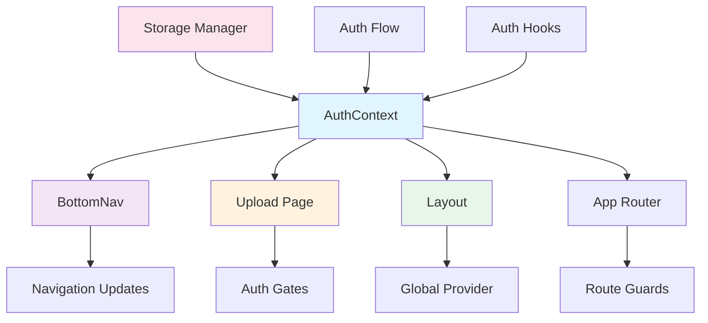

# Integration Points with Existing Components

## Overview

This document outlines the specific integration points where the new authentication system will connect with existing foodosys components. The integration strategy ensures minimal disruption to existing functionality while adding new authentication capabilities.

## Component Integration Map



## 1. BottomNav Component Integration

### Current Implementation Analysis
- Located at: [`src/components/BottomNav.tsx`](src/components/BottomNav.tsx:1)
- Already has authentication state management
- Shows different UI for authenticated/unauthenticated users
- Has sign out functionality

### Required Changes

```typescript
// Enhanced BottomNav with new auth integration
import { useAuth } from '@/hooks/useAuth'
import { useRouter } from 'next/navigation'

export default function BottomNav() {
  const { isAuthenticated, user, signOut, isLoading } = useAuth()
  const router = useRouter()
  const [activeNav, setActiveNav] = useState('home')

  // Enhanced authentication check
  useEffect(() => {
    const checkAuthStatus = async () => {
      if (isLoading) return
      
      // Update navigation based on auth state
      if (isAuthenticated) {
        setActiveNav('home')
      }
    }
    
    checkAuthStatus()
  }, [isAuthenticated, isLoading])

  const handleSignOut = async () => {
    try {
      await signOut()
      setActiveNav('home')
      router.push('/')
    } catch (error) {
      console.error('Sign out error:', error)
      // Show error toast or notification
    }
  }

  const handleUploadClick = () => {
    if (isAuthenticated) {
      router.push('/upload')
    } else {
      router.push('/auth?redirectTo=/upload')
    }
  }

  return (
    <div className="bottom-nav-container">
      <div className="bottom-nav">
        <Link 
          href="/" 
          className={`nav-item ${activeNav === 'home' ? 'active' : ''}`}
          onClick={() => setActiveNav('home')}
        >
          <i className="ri-home-4-fill"></i>
          <span className="nav-label">Home</span>
        </Link>
        
        {/* Enhanced Upload Button */}
        {isAuthenticated ? (
          <button 
            className="nav-upload"
            onClick={handleUploadClick}
            aria-label="Upload menu photos"
          >
            <i className="ri-camera-fill"></i>
            <span className="nav-label">Scan</span>
          </button>
        ) : (
          <Link 
            href="/auth?redirectTo=/upload" 
            className="nav-upload" 
            style={{ backgroundColor: '#FEF3C7' }}
          >
            <i className="ri-lock-line" style={{ color: '#92400E' }}></i>
            <span className="nav-label" style={{ color: '#92400E' }}>Sign In</span>
          </Link>
        )}

        {/* Enhanced Profile/Sign Out */}
        {isAuthenticated ? (
          <div className="nav-item" onClick={handleSignOut}>
            <i className="ri-logout-box-r-line"></i>
            <span className="nav-label">Sign Out</span>
            
            {/* User Email Display */}
            {user?.email && (
              <div className="user-email-tooltip">
                {user.email}
              </div>
            )}
          </div>
        ) : (
          <Link 
            href="/auth" 
            className={`nav-item ${activeNav === 'settings' ? 'active' : ''}`}
            onClick={() => setActiveNav('settings')}
          >
            <i className="ri-user-line"></i>
            <span className="nav-label">Profile</span>
          </Link>
        )}
      </div>
    </div>
  )
}
```

### Integration Benefits
- Seamless authentication state integration
- Improved user experience with contextual navigation
- Better error handling and user feedback
- Consistent with new authentication flow

## 2. Upload Page Integration

### Current Implementation Analysis
- Located at: [`src/app/upload/page.tsx`](src/app/upload/page.tsx:1)
- Already has authentication check
- Redirects to auth page if not authenticated
- Shows loading state during auth check

### Required Changes

```typescript
// Enhanced Upload page with improved auth integration
'use client'

import { useState, useEffect } from 'react'
import { useRouter } from 'next/navigation'
import BottomNav from '@/components/BottomNav'
import MenuUpload from '@/components/MenuUpload'
import { useAuth } from '@/hooks/useAuth'
import { StorageManager } from '@/lib/storage'

export default function UploadPage() {
  const router = useRouter()
  const { isAuthenticated, user, isLoading } = useAuth()
  const [selectedRestaurant, setSelectedRestaurant] = useState('')
  const [uploadStatus, setUploadStatus] = useState<'idle' | 'success' | 'error'>('idle')
  const [message, setMessage] = useState('')
  const [showToast, setShowToast] = useState(false)

  // Enhanced authentication check with better UX
  useEffect(() => {
    const checkAuthentication = async () => {
      if (isLoading) return
      
      if (!isAuthenticated) {
        // Store intended destination for redirect after auth
        const storageManager = new StorageManager()
        await storageManager.storePreferences({ 
          intendedDestination: '/upload' 
        })
        
        router.push('/auth?redirectTo=/upload')
        return
      }
      
      // Log successful authentication
      console.log('User authenticated:', user?.email)
    }

    checkAuthentication()
  }, [isAuthenticated, isLoading, router, user])

  const handleUploadSuccess = (response: any) => {
    setUploadStatus('success')
    setMessage('Uploaded Successfully!')
    setShowToast(true)
    
    // Update user karma points (if applicable)
    // This could trigger a re-fetch of user data
    
    setTimeout(() => {
      setShowToast(false)
      router.push('/')
    }, 2000)
  }

  const handleUploadError = (error: Error) => {
    setUploadStatus('error')
    setMessage(`Upload failed: ${error.message}`)
    setShowToast(true)
    
    setTimeout(() => {
      setShowToast(false)
    }, 3000)
  }

  // Enhanced loading state
  if (isLoading) {
    return (
      <div className="app-container" style={{ position: 'relative' }}>
        <div className="min-h-screen bg-[#FDFDE8] flex items-center justify-center">
          <div className="text-center">
            <div className="ri-loader-4-line text-4xl text-[#2C3E2E] animate-spin"></div>
            <p className="mt-4 text-[#889287]">Checking authentication...</p>
          </div>
        </div>
      </div>
    )
  }

  // Redirect state (will redirect to auth)
  if (!isAuthenticated) {
    return null
  }

  return (
    <div className="app-container" style={{ position: 'relative' }}>
      {/* Enhanced Back Button */}
      <button 
        onClick={() => router.back()}
        className="fixed top-6 left-6 z-10 w-10 h-10 bg-gray-100 rounded-full flex items-center justify-center text-gray-700"
        aria-label="Go back"
      >
        <i className="ri-close-line"></i>
      </button>

      <div className="upload-header">
        <div className="upload-title">Update Menu</div>
        <div className="upload-subtitle">
          You're helping ~30 students avoid a long walk. Nice! 🌱
        </div>
      </div>
      
      {/* Restaurant Selection */}
      <div className="form-group">
        <label className="label">Where are you?</label>
        <select
          value={selectedRestaurant}
          onChange={(e) => setSelectedRestaurant(e.target.value)}
          className="location-select"
        >
          <option value="">Select Food Court...</option>
          <option value="magna" selected>Magna Food Court (Detected)</option>
          <option value="fiesta">Fiesta Food Court</option>
          <option value="oasis">Oasis Food Court</option>
          <option value="maitri">Maitri Food Court</option>
        </select>
      </div>

      {/* Upload Component */}
      {selectedRestaurant ? (
        <MenuUpload
          restaurantSlug={selectedRestaurant}
          onUploadSuccess={handleUploadSuccess}
          onUploadError={handleUploadError}
        />
      ) : (
        <div className="camera-zone">
          <div className="camera-ui">
            <div className="camera-btn">
              <i className="ri-camera-fill"></i>
            </div>
            <div className="camera-text">Tap to Scan Menu</div>
          </div>
        </div>
      )}

      {/* Tip */}
      <div className="tip-container">
        <div className="tip-content">
          <i className="ri-lightbulb-flash-line tip-icon"></i>
          <div className="tip-text">
            <strong>Tip:</strong> Ensure that prices and item names are clearly visible for AI.
          </div>
        </div>
      </div>

      {/* Success Toast */}
      {showToast && (
        <div className="toast">
          <i className="ri-checkbox-circle-fill"></i> {message}
        </div>
      )}
      
      <BottomNav />
    </div>
  )
}
```

### Integration Benefits
- Better user experience during authentication checks
- Proper handling of redirect destinations
- Integration with user profile data
- Improved error handling and feedback

## 3. Layout Component Integration

### Current Implementation Analysis
- Located at: [`src/app/layout.tsx`](src/app/layout.tsx:1)
- Basic layout wrapper
- No authentication context provider

### Required Changes

```typescript
// Enhanced layout with auth context provider
import './globals.css'
import { Inter } from 'next/font/google'
import { AuthProvider } from '@/contexts/AuthContext'
import { StorageManager } from '@/lib/storage'

const inter = Inter({ subsets: ['latin'] })

export const metadata = {
  title: 'Mysore Mess Menus',
  description: 'View daily menus for Infosys Mysore campus food courts',
}

export default function RootLayout({
  children,
}: {
  children: React.ReactNode
}) {
  // Initialize storage manager
  const storageManager = new StorageManager()
  
  return (
    <html lang="en">
      <body className={inter.className}>
        <div className="app-container">
          <AuthProvider storageManager={storageManager}>
            {children}
          </AuthProvider>
        </div>
      </body>
    </html>
  )
}
```

### Integration Benefits
- Global authentication state availability
- Storage manager initialization
- Context provider for all components
- Centralized authentication management

## 4. App Router Integration

### Route Protection Strategy

```typescript
// Enhanced app router with auth guards
// This would be implemented in middleware or route protection

import { NextRequest, NextResponse } from 'next/server'
import { auth } from '@/lib/auth'

export async function middleware(request: NextRequest) {
  const { pathname } = request.nextUrl
  
  // Routes that require authentication
  const protectedRoutes = ['/upload', '/settings']
  const isProtectedRoute = protectedRoutes.some(route => 
    pathname.startsWith(route)
  )
  
  // Routes that should redirect if authenticated
  const authRoutes = ['/auth']
  const isAuthRoute = authRoutes.some(route => 
    pathname.startsWith(route)
  )
  
  // Get user from session
  const user = await auth.getCurrentUser()
  
  // Redirect logic
  if (isProtectedRoute && !user) {
    const url = request.nextUrl.clone()
    url.pathname = '/auth'
    url.searchParams.set('redirectTo', pathname)
    return NextResponse.redirect(url)
  }
  
  if (isAuthRoute && user) {
    return NextResponse.redirect(new URL('/', request.url))
  }
  
  return NextResponse.next()
}

export const config = {
  matcher: ['/upload/:path*', '/settings/:path*', '/auth/:path*']
}
```

### Integration Benefits
- Automatic route protection
- Seamless redirects for authentication
- Better user experience
- Centralized auth logic

## 5. Home Page Integration

### Current Implementation Analysis
- Located at: [`src/app/page.tsx`](src/app/page.tsx:1)
- No authentication dependency
- Static component structure

### Required Changes

```typescript
// Enhanced home page with auth-aware features
import Header from '@/components/Header'
import HeroSection from '@/components/HeroSection'
import FilterSection from '@/components/FilterSection'
import CourtList from '@/components/CourtList'
import BottomNav from '@/components/BottomNav'
import { useAuth } from '@/hooks/useAuth'

export default function Home() {
  const { isAuthenticated, user } = useAuth()
  
  return (
    <>
      <Header />
      <HeroSection />
      <FilterSection />
      <div className="section-title">Nearby Courts</div>
      
      {/* Enhanced CourtList with user context */}
      <CourtList user={user} isAuthenticated={isAuthenticated} />
      
      <BottomNav />
    </>
  )
}
```

### Integration Benefits
- User context available to all components
- Personalized content based on auth state
- Consistent navigation experience

## 6. Settings Page Integration

### Current Implementation Analysis
- Located at: [`src/app/settings/page.tsx`](src/app/settings/page.tsx:1)
- Basic settings page
- No authentication integration

### Required Changes

```typescript
// Enhanced settings page with profile management
'use client'

import { useState, useEffect } from 'react'
import { useRouter } from 'next/navigation'
import BottomNav from '@/components/BottomNav'
import { useAuth } from '@/hooks/useAuth'
import { StorageManager } from '@/lib/storage'

export default function SettingsPage() {
  const router = useRouter()
  const { user, isAuthenticated, signOut } = useAuth()
  const [loading, setLoading] = useState(false)
  const [message, setMessage] = useState('')
  const storageManager = new StorageManager()

  useEffect(() => {
    if (!isAuthenticated) {
      router.push('/auth?redirectTo=/settings')
      return
    }
  }, [isAuthenticated, router])

  const handleSignOut = async () => {
    setLoading(true)
    try {
      await signOut()
      setMessage('Signed out successfully')
      setTimeout(() => {
        router.push('/')
      }, 1000)
    } catch (error) {
      setMessage('Error signing out')
      console.error('Sign out error:', error)
    } finally {
      setLoading(false)
    }
  }

  const handleProfileUpdate = async (profileData: any) => {
    setLoading(true)
    try {
      // Update profile logic here
      setMessage('Profile updated successfully')
    } catch (error) {
      setMessage('Error updating profile')
      console.error('Profile update error:', error)
    } finally {
      setLoading(false)
    }
  }

  if (!isAuthenticated) {
    return null // Will redirect
  }

  return (
    <div className="app-container">
      <div className="settings-header">
        <h1>Settings</h1>
        <p>Manage your profile and preferences</p>
      </div>
      
      {/* Profile Section */}
      <div className="settings-section">
        <h2>Profile Information</h2>
        <div className="profile-info">
          <div className="profile-avatar">
            {user?.user_metadata?.avatar_url ? (
              
            ) : (
              <div className="avatar-placeholder">
                <i className="ri-user-smile-line"></i>
              </div>
            )}
          </div>
          
          <div className="profile-details">
            <p><strong>Name:</strong> {user?.user_metadata?.display_name || 'Not set'}</p>
            <p><strong>Email:</strong> {user?.email}</p>
            <p><strong>Role:</strong> {user?.user_metadata?.role || 'Not set'}</p>
            <p><strong>Location:</strong> {user?.user_metadata?.base_location || 'Not set'}</p>
            <p><strong>Dietary Preference:</strong> {user?.user_metadata?.dietary_preference || 'Not set'}</p>
          </div>
        </div>
      </div>
      
      {/* Actions */}
      <div className="settings-section">
        <h2>Actions</h2>
        <button 
          onClick={handleSignOut}
          disabled={loading}
          className="sign-out-btn"
        >
          {loading ? 'Signing out...' : 'Sign Out'}
        </button>
      </div>
      
      {/* Message Display */}
      {message && (
        <div className="settings-message">
          {message}
        </div>
      )}
      
      <BottomNav />
    </div>
  )
}
```

### Integration Benefits
- Profile management capabilities
- User settings persistence
- Sign out functionality
- Authentication-gated access

## 7. API Integration Points

### Profile API Enhancement

```typescript
// Enhanced profile API route
// src/app/api/profile/route.ts

import { createClient } from '@supabase/supabase-js'
import { NextRequest, NextResponse } from 'next/server'

const supabase = createClient(
  process.env.NEXT_PUBLIC_SUPABASE_URL!,
  process.env.SUPABASE_SERVICE_ROLE_KEY!
)

export async function POST(request: NextRequest) {
  try {
    const { 
      user_id, 
      display_name, 
      avatar_url, 
      role, 
      base_location, 
      dietary_preference,
      email // Add email for auto sign-in
    } = await request.json()

    // Check if profile already exists
    const { data: existingProfile } = await supabase
      .from('user_profiles')
      .select('*')
      .eq('user_id', user_id)
      .single()

    if (existingProfile) {
      return NextResponse.json({ error: 'Profile already exists' }, { status: 400 })
    }

    // Create new profile with enhanced fields
    const { data, error } = await supabase
      .from('user_profiles')
      .insert({
        user_id,
        display_name,
        avatar_url,
        role: role || 'trainee',
        base_location,
        dietary_preference: dietary_preference || 'vegetarian',
        karma_points: 0,
        level: 1,
        email // Store email for auto sign-in
      })
      .select()
      .single()

    if (error) {
      console.error('Error creating profile:', error)
      return NextResponse.json({ error: error.message }, { status: 500 })
    }

    // Initialize leaderboard entry
    await supabase
      .from('leaderboard')
      .insert({
        user_id: data.id,
        rank_position: null,
        total_karma: 0,
        weekly_karma: 0,
        monthly_karma: 0
      })

    return NextResponse.json({ profile: data }, { status: 201 })
  } catch (error) {
    console.error('Profile creation error:', error)
    return NextResponse.json({ error: 'Internal server error' }, { status: 500 })
  }
}

export async function GET(request: NextRequest) {
  try {
    const { searchParams } = new URL(request.url)
    const user_id = searchParams.get('user_id')

    if (!user_id) {
      return NextResponse.json({ error: 'user_id is required' }, { status: 400 })
    }

    const { data, error } = await supabase
      .from('user_profiles')
      .select('*')
      .eq('user_id', user_id)
      .single()

    if (error) {
      if (error.code === 'PGRST116') {
        return NextResponse.json({ error: 'Profile not found' }, { status: 404 })
      }
      console.error('Error fetching profile:', error)
      return NextResponse.json({ error: error.message }, { status: 500 })
    }

    return NextResponse.json({ profile: data })
  } catch (error) {
    console.error('Profile fetch error:', error)
    return NextResponse.json({ error: 'Internal server error' }, { status: 500 })
  }
}
```

## Integration Testing Strategy

### 1. Component Integration Tests
- Test authentication state propagation
- Verify navigation updates
- Check route protection
- Validate error handling

### 2. User Flow Tests
- Complete sign up flow
- Sign in with stored credentials
- Sign out and cleanup
- Redirect handling

### 3. Cross-Component Tests
- Auth context availability
- State synchronization
- Storage integration
- Error propagation

## Migration Strategy

### Phase 1: Foundation (Week 1)
1. Implement AuthContext and useAuth hook
2. Update layout.tsx with provider
3. Enhance BottomNav component
4. Test basic authentication flow

### Phase 2: Page Integration (Week 2)
1. Update Upload page with new auth
2. Enhance Settings page
3. Implement route protection
4. Test protected routes

### Phase 3: Storage Integration (Week 3)
1. Implement StorageManager
2. Add secure local storage
3. Integrate auto sign-in
4. Test credential persistence

### Phase 4: Polish and Testing (Week 4)
1. Error handling improvements
2. User experience enhancements
3. Performance optimization
4. Comprehensive testing

This integration strategy ensures that the new authentication system seamlessly integrates with existing foodosys components while providing enhanced functionality and user experience.