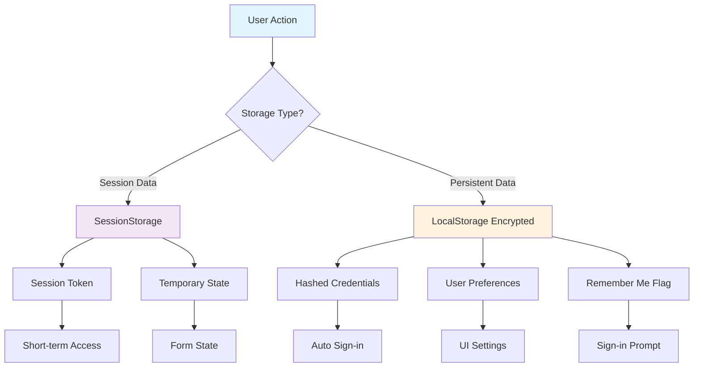

# Local Storage Strategy for Authentication

## Overview

This document outlines the secure local storage strategy for persisting user credentials and session data in the foodosys application. The strategy balances user convenience with security best practices.

## Storage Architecture

### Storage Layers



## Data Types and Structures

### 1. Session Data (SessionStorage)

```typescript
interface SessionData {
  token: string
  user: {
    id: string
    email: string
    displayName: string
    avatarUrl?: string
  }
  expiresAt: number
  isAuthenticated: boolean
}
```

### 2. Persistent Data (Encrypted LocalStorage)

```typescript
interface StoredCredentials {
  email: string
  hashedPassword: string
  salt: string
  algorithm: 'bcrypt'
  iterations: number
  createdAt: number
  lastUsedAt: number
}

interface UserPreferences {
  rememberMe: boolean
  autoSignIn: boolean
  theme: 'light' | 'dark' | 'auto'
  language: string
  onboardingCompleted: boolean
}

interface StorageMetadata {
  version: string
  encryptionKey: string
  checksum: string
}
```

## Security Implementation

### Encryption Strategy

```typescript
// Encryption utilities
class SecureStorage {
  private static readonly ALGORITHM = 'AES-GCM'
  private static readonly KEY_LENGTH = 256
  private static readonly IV_LENGTH = 12
  
  // Generate encryption key from user credentials
  private static generateKey(email: string, password: string): string {
    const encoder = new TextEncoder()
    const data = encoder.encode(`${email}:${password}`)
    return crypto.subtle.digest('SHA-256', data)
      .then(hash => btoa(String.fromCharCode(...new Uint8Array(hash))))
  }
  
  // Encrypt sensitive data
  static async encrypt(data: string, key: string): Promise<EncryptedData> {
    const iv = crypto.getRandomValues(new Uint8Array(this.IV_LENGTH))
    const cryptoKey = await crypto.subtle.importKey(
      'raw',
      this.base64ToArray(key),
      { name: this.ALGORITHM },
      false,
      ['encrypt']
    )
    
    const encoder = new TextEncoder()
    const encodedData = encoder.encode(data)
    
    const encryptedData = await crypto.subtle.encrypt(
      { name: this.ALGORITHM, iv },
      cryptoKey,
      encodedData
    )
    
    return {
      data: btoa(String.fromCharCode(...new Uint8Array(encryptedData))),
      iv: btoa(String.fromCharCode(...iv)),
      algorithm: this.ALGORITHM
    }
  }
  
  // Decrypt sensitive data
  static async decrypt(encryptedData: EncryptedData, key: string): Promise<string> {
    const cryptoKey = await crypto.subtle.importKey(
      'raw',
      this.base64ToArray(key),
      { name: this.ALGORITHM },
      false,
      ['decrypt']
    )
    
    const decryptedData = await crypto.subtle.decrypt(
      { 
        name: this.ALGORITHM, 
        iv: this.base64ToArray(encryptedData.iv) 
      },
      cryptoKey,
      this.base64ToArray(encryptedData.data)
    )
    
    return new TextDecoder().decode(decryptedData)
  }
  
  private static base64ToArray(base64: string): Uint8Array {
    const binaryString = atob(base64)
    return new Uint8Array(binaryString.length).map((_, i) => 
      binaryString.charCodeAt(i)
    )
  }
}
```

### Password Hashing

```typescript
// Secure password hashing
class PasswordHasher {
  private static readonly SALT_LENGTH = 32
  private static readonly ITERATIONS = 100000
  
  // Hash password with salt
  static async hash(password: string, salt?: string): Promise<HashedPassword> {
    const generatedSalt = salt || crypto.getRandomValues(new Uint8Array(this.SALT_LENGTH))
    const encoder = new TextEncoder()
    
    const importedKey = await crypto.subtle.importKey(
      'raw',
      encoder.encode(password),
      { name: 'PBKDF2' },
      false,
      ['deriveBits']
    )
    
    const derivedBits = await crypto.subtle.deriveBits(
      {
        name: 'PBKDF2',
        salt: generatedSalt,
        iterations: this.ITERATIONS,
        hash: 'SHA-256'
      },
      importedKey,
      256
    )
    
    return {
      hash: btoa(String.fromCharCode(...new Uint8Array(derivedBits))),
      salt: btoa(String.fromCharCode(...generatedSalt)),
      algorithm: 'PBKDF2',
      iterations: this.ITERATIONS
    }
  }
  
  // Verify password against hash
  static async verify(password: string, hashedPassword: HashedPassword): Promise<boolean> {
    const { hash, salt } = hashedPassword
    const computedHash = await this.hash(password, atob(salt))
    return hash === computedHash.hash
  }
}
```

## Storage Operations

### Secure Storage Interface

```typescript
interface SecureStorageInterface {
  set<T>(key: string, value: T, options?: StorageOptions): Promise<void>
  get<T>(key: string): Promise<T | null>
  remove(key: string): Promise<void>
  clear(): Promise<void>
  exists(key: string): Promise<boolean>
}

interface StorageOptions {
  encrypt?: boolean
  expiresIn?: number // milliseconds
  sessionOnly?: boolean
}

// Implementation
class SecureLocalStorage implements SecureStorageInterface {
  private encryptionKey: string | null = null
  
  constructor() {
    this.initializeEncryptionKey()
  }
  
  private async initializeEncryptionKey() {
    const storedKey = localStorage.getItem('storage_key')
    if (storedKey) {
      this.encryptionKey = storedKey
      return
    }
    
    // Generate new key for this session
    this.encryptionKey = crypto.getRandomValues(new Uint8Array(32))
      .reduce((key, byte) => key + byte.toString(16).padStart(2, '0'), '')
    localStorage.setItem('storage_key', this.encryptionKey)
  }
  
  async set<T>(key: string, value: T, options: StorageOptions = {}): Promise<void> {
    const storage = options.sessionOnly ? sessionStorage : localStorage
    
    if (options.encrypt) {
      const encrypted = await SecureStorage.encrypt(JSON.stringify(value), this.encryptionKey!)
      storage.setItem(key, JSON.stringify(encrypted))
    } else {
      storage.setItem(key, JSON.stringify(value))
    }
    
    if (options.expiresIn) {
      const expiryKey = `${key}_expiry`
      storage.setItem(expiryKey, String(Date.now() + options.expiresIn))
    }
  }
  
  async get<T>(key: string): Promise<T | null> {
    // Check expiry first
    const storage = this.getStorageForKey(key)
    const expiryKey = `${key}_expiry`
    const expiry = storage.getItem(expiryKey)
    
    if (expiry && Date.now() > parseInt(expiry)) {
      storage.removeItem(key)
      storage.removeItem(expiryKey)
      return null
    }
    
    const item = storage.getItem(key)
    if (!item) return null
    
    try {
      const parsed = JSON.parse(item)
      
      // Check if this is encrypted data
      if (parsed.data && parsed.iv && parsed.algorithm) {
        const decrypted = await SecureStorage.decrypt(parsed, this.encryptionKey!)
        return JSON.parse(decrypted)
      }
      
      return parsed
    } catch {
      return null
    }
  }
  
  async remove(key: string): Promise<void> {
    const storage = this.getStorageForKey(key)
    storage.removeItem(key)
    storage.removeItem(`${key}_expiry`)
  }
  
  async clear(): Promise<void> {
    localStorage.clear()
    sessionStorage.clear()
  }
  
  private getStorageForKey(key: string): Storage {
    // Check if key exists in sessionStorage first
    if (sessionStorage.getItem(key)) return sessionStorage
    return localStorage
  }
}
```

## Storage Keys and Data Management

### Key Naming Convention

```typescript
enum StorageKeys {
  // Session data (sessionStorage)
  SESSION_TOKEN = 'foodosys_session',
  USER_DATA = 'foodosys_user',
  
  // Persistent data (encrypted localStorage)
  CREDENTIALS = 'foodosys_creds',
  USER_PREFERENCES = 'foodosys_prefs',
  
  // Metadata
  STORAGE_VERSION = 'foodosys_version',
  LAST_ACTIVITY = 'foodosys_activity',
  ENCRYPTION_KEY = 'foodosys_key'
}
```

### Data Lifecycle Management

```typescript
class StorageManager {
  private storage: SecureLocalStorage
  private static readonly CREDENTIAL_EXPIRY_DAYS = 30
  
  constructor() {
    this.storage = new SecureLocalStorage()
    this.initializeStorage()
  }
  
  private async initializeStorage() {
    // Check storage version
    const version = await this.storage.get<string>(StorageKeys.STORAGE_VERSION)
    if (version !== '1.0.0') {
      await this.migrateStorage(version)
    }
    
    // Clean up expired data
    await this.cleanupExpiredData()
  }
  
  // Store credentials securely
  async storeCredentials(email: string, password: string, rememberMe: boolean): Promise<void> {
    if (!rememberMe) {
      await this.storage.remove(StorageKeys.CREDENTIALS)
      return
    }
    
    const hashedPassword = await PasswordHasher.hash(password)
    const credentials: StoredCredentials = {
      email,
      hashedPassword: hashedPassword.hash,
      salt: hashedPassword.salt,
      algorithm: hashedPassword.algorithm,
      iterations: hashedPassword.iterations,
      createdAt: Date.now(),
      lastUsedAt: Date.now()
    }
    
    await this.storage.set(StorageKeys.CREDENTIALS, credentials, {
      encrypt: true
    })
  }
  
  // Retrieve stored credentials
  async getStoredCredentials(): Promise<StoredCredentials | null> {
    return await this.storage.get<StoredCredentials>(StorageKeys.CREDENTIALS)
  }
  
  // Verify stored credentials
  async verifyCredentials(email: string, password: string): Promise<boolean> {
    const stored = await this.getStoredCredentials()
    if (!stored || stored.email !== email) return false
    
    return await PasswordHasher.verify(password, {
      hash: stored.hashedPassword,
      salt: stored.salt,
      algorithm: stored.algorithm,
      iterations: stored.iterations
    })
  }
  
  // Store session data
  async storeSession(token: string, user: AuthUser): Promise<void> {
    const sessionData: SessionData = {
      token,
      user: {
        id: user.id,
        email: user.email,
        displayName: user.user_metadata?.display_name || user.email,
        avatarUrl: user.user_metadata?.avatar_url
      },
      expiresAt: Date.now() + (24 * 60 * 60 * 1000), // 24 hours
      isAuthenticated: true
    }
    
    await this.storage.set(StorageKeys.SESSION_TOKEN, token, {
      sessionOnly: true,
      expiresIn: 24 * 60 * 60 * 1000
    })
    
    await this.storage.set(StorageKeys.USER_DATA, sessionData.user, {
      sessionOnly: true
    })
  }
  
  // Get current session
  async getCurrentSession(): Promise<SessionData | null> {
    const token = await this.storage.get<string>(StorageKeys.SESSION_TOKEN)
    const userData = await this.storage.get(StorageKeys.USER_DATA)
    
    if (!token || !userData) return null
    
    return {
      token,
      user: userData,
      expiresAt: 0, // Will be set by storage
      isAuthenticated: true
    }
  }
  
  // Clear session
  async clearSession(): Promise<void> {
    await this.storage.remove(StorageKeys.SESSION_TOKEN)
    await this.storage.remove(StorageKeys.USER_DATA)
  }
  
  // Store user preferences
  async storePreferences(preferences: Partial<UserPreferences>): Promise<void> {
    const current = await this.storage.get<UserPreferences>(StorageKeys.USER_PREFERENCES) || {}
    const updated = { ...current, ...preferences }
    
    await this.storage.set(StorageKeys.USER_PREFERENCES, updated, {
      encrypt: true
    })
  }
  
  // Get user preferences
  async getPreferences(): Promise<UserPreferences> {
    return await this.storage.get<UserPreferences>(StorageKeys.USER_PREFERENCES) || {
      rememberMe: false,
      autoSignIn: false,
      theme: 'auto',
      language: 'en',
      onboardingCompleted: false
    }
  }
  
  // Clean up expired data
  private async cleanupExpiredData(): Promise<void> {
    const lastActivity = await this.storage.get<number>(StorageKeys.LAST_ACTIVITY)
    const thirtyDaysAgo = Date.now() - (30 * 24 * 60 * 60 * 1000)
    
    if (lastActivity && lastActivity < thirtyDaysAgo) {
      await this.storage.remove(StorageKeys.CREDENTIALS)
    }
    
    await this.storage.set(StorageKeys.LAST_ACTIVITY, Date.now())
  }
  
  // Migrate storage data
  private async migrateStorage(fromVersion?: string): Promise<void> {
    // Handle storage migrations here
    await this.storage.set(StorageKeys.STORAGE_VERSION, '1.0.0')
  }
}
```

## Integration with Authentication Flow

### Auto Sign-in Process

```typescript
const useAutoSignIn = () => {
  const { signIn } = useAuth()
  const storageManager = new StorageManager()
  
  useEffect(() => {
    const attemptAutoSignIn = async () => {
      const preferences = await storageManager.getPreferences()
      
      if (!preferences.autoSignIn || !preferences.rememberMe) {
        return
      }
      
      const credentials = await storageManager.getStoredCredentials()
      if (!credentials) return
      
      try {
        // Attempt to verify credentials with Supabase
        const isValid = await storageManager.verifyCredentials(
          credentials.email,
          credentials.password
        )
        
        if (isValid) {
          // Auto sign in successful
          await signIn(credentials.email, credentials.password)
        }
      } catch (error) {
        console.error('Auto sign-in failed:', error)
        // Clear invalid credentials
        await storageManager.remove(StorageKeys.CREDENTIALS)
      }
    }
    
    attemptAutoSignIn()
  }, [signIn])
}
```

## Security Considerations

### 1. Data Protection
- **Encryption at rest**: All sensitive data encrypted in localStorage
- **Strong encryption**: AES-GCM with 256-bit keys
- **Key management**: Session-based encryption keys
- **Secure hashing**: PBKDF2 with 100,000 iterations

### 2. Access Control
- **Session isolation**: Session data in sessionStorage
- **Origin protection**: Storage accessible only from same origin
- **Path restriction**: Storage scoped to app path
- **Subdomain isolation**: No cross-subdomain access

### 3. Data Integrity
- **Checksums**: Verify data integrity on retrieval
- **Version control**: Handle storage migrations
- **Expiration handling**: Automatic cleanup of old data
- **Validation**: Type checking and schema validation

### 4. Privacy Protection
- **Minimal data**: Store only necessary information
- **User control**: Clear opt-in for data storage
- **Easy removal**: Simple data deletion
- **Transparency**: Clear documentation of stored data

## Performance Considerations

### 1. Optimization Strategies
- **Lazy loading**: Initialize storage only when needed
- **Async operations**: Non-blocking storage operations
- **Caching**: Cache frequently accessed data
- **Batching**: Group multiple storage operations

### 2. Memory Management
- **Cleanup**: Remove unused data
- **Compression**: Compress large data objects
- **Garbage collection**: Regular cleanup of expired data
- **Efficient updates**: Avoid unnecessary writes

### 3. Browser Compatibility
- **Feature detection**: Check for storage availability
- **Fallbacks**: Graceful degradation for older browsers
- **Error handling**: Robust error catching
- **Size limits**: Respect storage quota limits

## Testing Strategy

### 1. Unit Tests
- Encryption/decryption functions
- Password hashing and verification
- Storage operations
- Data validation
- Error handling

### 2. Integration Tests
- Auto sign-in flow
- Session management
- Preference storage
- Migration scenarios

### 3. Security Tests
- Encryption strength verification
- Key management security
- Data integrity checks
- Access control validation

This local storage strategy provides a secure, user-friendly approach to credential persistence while maintaining strong security practices and performance optimization.