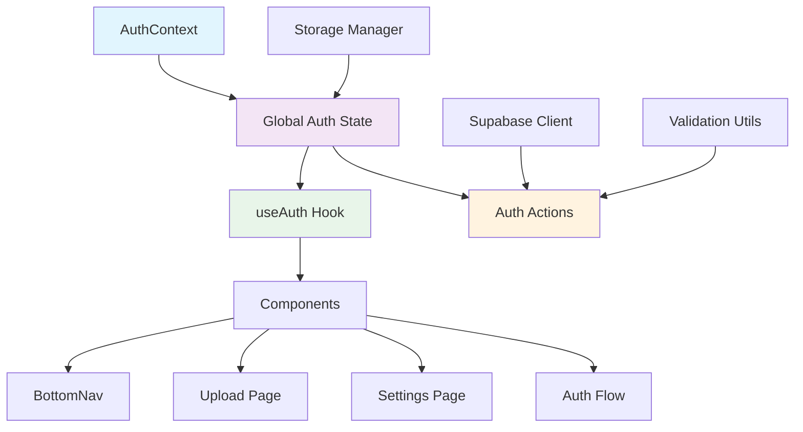

# State Management Approach for Authentication

## Overview

This document outlines the state management approach for the authentication system in foodosys. The strategy uses React Context API combined with custom hooks to provide a centralized, efficient, and maintainable authentication state management solution.

## State Management Architecture



## 1. AuthContext Implementation

### Context Structure

```typescript
// src/contexts/AuthContext.tsx
'use client'

import React, { createContext, useContext, useReducer, useEffect, ReactNode } from 'react'
import { AuthUser } from '@/lib/auth'
import { StorageManager } from '@/lib/storage'
import { supabase } from '@/lib/supabase'

// State interface
interface AuthState {
  isAuthenticated: boolean
  user: AuthUser | null
  isLoading: boolean
  error: string | null
  isOnboarding: boolean
  lastActivity: number
}

// Action types
type AuthAction =
  | { type: 'AUTH_START' }
  | { type: 'AUTH_SUCCESS'; payload: AuthUser }
  | { type: 'AUTH_ERROR'; payload: string }
  | { type: 'AUTH_LOGOUT' }
  | { type: 'AUTH_CLEAR_ERROR' }
  | { type: 'AUTH_SET_LOADING'; payload: boolean }
  | { type: 'AUTH_SET_ONBOARDING'; payload: boolean }
  | { type: 'AUTH_UPDATE_USER'; payload: Partial<AuthUser> }
  | { type: 'AUTH_UPDATE_ACTIVITY' }

// Context type
interface AuthContextType {
  state: AuthState
  actions: {
    signIn: (email: string, password: string, rememberMe?: boolean) => Promise<void>
    signUp: (userData: SignUpData) => Promise<void>
    signOut: () => Promise<void>
    clearError: () => void
    updateProfile: (updates: Partial<AuthUser>) => void
    checkAuthStatus: () => Promise<void>
  }
}

// Initial state
const initialState: AuthState = {
  isAuthenticated: false,
  user: null,
  isLoading: true,
  error: null,
  isOnboarding: false,
  lastActivity: Date.now()
}

// Reducer function
const authReducer = (state: AuthState, action: AuthAction): AuthState => {
  switch (action.type) {
    case 'AUTH_START':
      return {
        ...state,
        isLoading: true,
        error: null
      }
    
    case 'AUTH_SUCCESS':
      return {
        ...state,
        isAuthenticated: true,
        user: action.payload,
        isLoading: false,
        error: null,
        lastActivity: Date.now()
      }
    
    case 'AUTH_ERROR':
      return {
        ...state,
        isAuthenticated: false,
        user: null,
        isLoading: false,
        error: action.payload
      }
    
    case 'AUTH_LOGOUT':
      return {
        ...state,
        isAuthenticated: false,
        user: null,
        isLoading: false,
        error: null
      }
    
    case 'AUTH_CLEAR_ERROR':
      return {
        ...state,
        error: null
      }
    
    case 'AUTH_SET_LOADING':
      return {
        ...state,
        isLoading: action.payload
      }
    
    case 'AUTH_SET_ONBOARDING':
      return {
        ...state,
        isOnboarding: action.payload
      }
    
    case 'AUTH_UPDATE_USER':
      return {
        ...state,
        user: state.user ? { ...state.user, ...action.payload } : null
      }
    
    case 'AUTH_UPDATE_ACTIVITY':
      return {
        ...state,
        lastActivity: Date.now()
      }
    
    default:
      return state
  }
}

// Create context
const AuthContext = createContext<AuthContextType | undefined>(undefined)

// Provider component
export const AuthProvider: React.FC<{ children: ReactNode; storageManager: StorageManager }> = ({ 
  children, 
  storageManager 
}) => {
  const [state, dispatch] = useReducer(authReducer, initialState)

  // Initialize authentication on mount
  useEffect(() => {
    const initializeAuth = async () => {
      dispatch({ type: 'AUTH_SET_LOADING', payload: true })
      
      try {
        // Check for existing session
        const session = await storageManager.getCurrentSession()
        
        if (session && session.token) {
          // Validate session with Supabase
          const { data: { user } } = await supabase.auth.getUser(session.token)
          
          if (user) {
            dispatch({ type: 'AUTH_SUCCESS', payload: user })
            return
          }
        }
        
        // Try auto sign-in with stored credentials
        const preferences = await storageManager.getPreferences()
        if (preferences.autoSignIn && preferences.rememberMe) {
          const credentials = await storageManager.getStoredCredentials()
          
          if (credentials) {
            const { data, error } = await supabase.auth.signInWithPassword({
              email: credentials.email,
              password: credentials.password
            })
            
            if (!error && data.user) {
              await storageManager.storeSession(data.session.access_token, data.user)
              dispatch({ type: 'AUTH_SUCCESS', payload: data.user })
              return
            }
          }
        }
        
        // No valid authentication found
        dispatch({ type: 'AUTH_SET_LOADING', payload: false })
      } catch (error) {
        dispatch({ type: 'AUTH_ERROR', payload: error.message })
      }
    }

    initializeAuth()
  }, [storageManager])

  // Auth actions
  const actions: AuthContextType['actions'] = {
    signIn: async (email: string, password: string, rememberMe = false) => {
      dispatch({ type: 'AUTH_START' })
      
      try {
        const { data, error } = await supabase.auth.signInWithPassword({
          email,
          password
        })
        
        if (error) throw error
        
        // Store session and credentials
        await storageManager.storeSession(data.session.access_token, data.user)
        await storageManager.storeCredentials(email, password, rememberMe)
        await storageManager.storePreferences({ rememberMe, autoSignIn: true })
        
        dispatch({ type: 'AUTH_SUCCESS', payload: data.user })
      } catch (error) {
        dispatch({ type: 'AUTH_ERROR', payload: error.message })
        throw error
      }
    },

    signUp: async (userData: SignUpData) => {
      dispatch({ type: 'AUTH_START' })
      
      try {
        // Create auth user
        const { data, error } = await supabase.auth.signUp({
          email: userData.email,
          password: userData.password,
          options: {
            data: {
              display_name: userData.displayName,
              role: userData.role,
              base_location: userData.baseLocation,
              dietary_preference: userData.dietaryPreference,
              avatar_url: userData.avatarUrl
            }
          }
        })
        
        if (error) throw error
        
        // Create profile
        const profileResponse = await fetch('/api/profile', {
          method: 'POST',
          headers: {
            'Content-Type': 'application/json'
          },
          body: JSON.stringify({
            user_id: data.user.id,
            display_name: userData.displayName,
            avatar_url: userData.avatarUrl,
            role: userData.role,
            base_location: userData.baseLocation,
            dietary_preference: userData.dietaryPreference,
            email: userData.email
          })
        })
        
        if (!profileResponse.ok) {
          throw new Error('Failed to create profile')
        }
        
        // Store session and credentials
        await storageManager.storeSession(data.session.access_token, data.user)
        await storageManager.storeCredentials(userData.email, userData.password, userData.rememberMe)
        await storageManager.storePreferences({ 
          rememberMe: userData.rememberMe, 
          autoSignIn: true,
          onboardingCompleted: true 
        })
        
        dispatch({ type: 'AUTH_SUCCESS', payload: data.user })
      } catch (error) {
        dispatch({ type: 'AUTH_ERROR', payload: error.message })
        throw error
      }
    },

    signOut: async () => {
      dispatch({ type: 'AUTH_START' })
      
      try {
        await supabase.auth.signOut()
        await storageManager.clearSession()
        dispatch({ type: 'AUTH_LOGOUT' })
      } catch (error) {
        dispatch({ type: 'AUTH_ERROR', payload: error.message })
        throw error
      }
    },

    clearError: () => {
      dispatch({ type: 'AUTH_CLEAR_ERROR' })
    },

    updateProfile: (updates: Partial<AuthUser>) => {
      dispatch({ type: 'AUTH_UPDATE_USER', payload: updates })
    },

    checkAuthStatus: async () => {
      try {
        const { data: { user } } = await supabase.auth.getUser()
        
        if (user) {
          dispatch({ type: 'AUTH_SUCCESS', payload: user })
        } else {
          dispatch({ type: 'AUTH_LOGOUT' })
        }
      } catch (error) {
        dispatch({ type: 'AUTH_ERROR', payload: error.message })
      }
    }
  }

  // Listen for auth changes
  useEffect(() => {
    const { data: { subscription } } = supabase.auth.onAuthStateChange(
      async (event, session) => {
        if (event === 'SIGNED_IN' && session?.user) {
          await storageManager.storeSession(session.access_token, session.user)
          dispatch({ type: 'AUTH_SUCCESS', payload: session.user })
        } else if (event === 'SIGNED_OUT') {
          await storageManager.clearSession()
          dispatch({ type: 'AUTH_LOGOUT' })
        }
      }
    )

    return () => {
      subscription?.unsubscribe()
    }
  }, [])

  return (
    <AuthContext.Provider value={{ state, actions }}>
      {children}
    </AuthContext.Provider>
  )
}

// Hook to use context
export const useAuthContext = () => {
  const context = useContext(AuthContext)
  if (context === undefined) {
    throw new Error('useAuthContext must be used within an AuthProvider')
  }
  return context
}
```

## 2. useAuth Hook Implementation

```typescript
// src/hooks/useAuth.ts
'use client'

import { useCallback, useMemo } from 'react'
import { useAuthContext } from '@/contexts/AuthContext'

export const useAuth = () => {
  const { state, actions } = useAuthContext()

  // Memoized selectors
  const isAuthenticated = useMemo(() => state.isAuthenticated, [state.isAuthenticated])
  const user = useMemo(() => state.user, [state.user])
  const isLoading = useMemo(() => state.isLoading, [state.isLoading])
  const error = useMemo(() => state.error, [state.error])
  const isOnboarding = useMemo(() => state.isOnboarding, [state.isOnboarding])

  // Memoized actions
  const signIn = useCallback(
    (email: string, password: string, rememberMe?: boolean) => 
      actions.signIn(email, password, rememberMe),
    [actions.signIn]
  )

  const signUp = useCallback(
    (userData: SignUpData) => actions.signUp(userData),
    [actions.signUp]
  )

  const signOut = useCallback(
    () => actions.signOut(),
    [actions.signOut]
  )

  const clearError = useCallback(
    () => actions.clearError(),
    [actions.clearError]
  )

  const updateProfile = useCallback(
    (updates: Partial<AuthUser>) => actions.updateProfile(updates),
    [actions.updateProfile]
  )

  const checkAuthStatus = useCallback(
    () => actions.checkAuthStatus(),
    [actions.checkAuthStatus]
  )

  return {
    // State
    isAuthenticated,
    user,
    isLoading,
    error,
    isOnboarding,
    
    // Actions
    signIn,
    signUp,
    signOut,
    clearError,
    updateProfile,
    checkAuthStatus
  }
}
```

## 3. Specialized Hooks

### useAuthFlow Hook

```typescript
// src/hooks/useAuthFlow.ts
'use client'

import { useState, useCallback, useEffect } from 'react'
import { useAuth } from './useAuth'
import { validateEmail, validatePassword, validateDisplayName } from '@/lib/validation'

interface AuthFlowState {
  mode: 'signin' | 'signup'
  currentStep: number
  isTransitioning: boolean
  formData: SignUpFormData
  errors: Record<string, string>
}

const useAuthFlow = (initialMode: 'signin' | 'signup' = 'signin') => {
  const { signIn, signUp, clearError } = useAuth()
  const [state, setState] = useState<AuthFlowState>({
    mode: initialMode,
    currentStep: 0,
    isTransitioning: false,
    formData: getDefaultFormData(),
    errors: {}
  })

  // Update form data
  const updateFormData = useCallback((field: string, value: any) => {
    setState(prev => ({
      ...prev,
      formData: { ...prev.formData, [field]: value },
      errors: { ...prev.errors, [field]: '' } // Clear field error on update
    }))
  }, [])

  // Validate current step
  const validateCurrentStep = useCallback(() => {
    const { currentStep, formData } = state
    let errors: Record<string, string> = {}

    switch (currentStep) {
      case 0: // Email/Password step
        if (!validateEmail(formData.email)) {
          errors.email = 'Please enter a valid email address'
        }
        if (!validatePassword(formData.password)) {
          errors.password = 'Password must be at least 8 characters with uppercase, lowercase, and numbers'
        }
        if (formData.password !== formData.confirmPassword) {
          errors.confirmPassword = 'Passwords do not match'
        }
        break
      
      case 1: // Display name step
        if (!validateDisplayName(formData.displayName)) {
          errors.displayName = 'Display name must be between 2 and 50 characters'
        }
        break
      
      // Add more step validations as needed
    }

    setState(prev => ({ ...prev, errors }))
    return Object.keys(errors).length === 0
  }, [state.currentStep, state.formData])

  // Next step
  const nextStep = useCallback(async () => {
    if (!validateCurrentStep()) return

    setState(prev => ({ ...prev, isTransitioning: true }))
    
    setTimeout(() => {
      setState(prev => ({
        ...prev,
        currentStep: prev.currentStep + 1,
        isTransitioning: false
      }))
    }, 300)
  }, [validateCurrentStep])

  // Previous step
  const prevStep = useCallback(() => {
    setState(prev => ({ ...prev, isTransitioning: true }))
    
    setTimeout(() => {
      setState(prev => ({
        ...prev,
        currentStep: Math.max(0, prev.currentStep - 1),
        isTransitioning: false
      }))
    }, 300)
  }, [])

  // Submit form
  const submitForm = useCallback(async () => {
    clearError()
    
    try {
      if (state.mode === 'signin') {
        await signIn(state.formData.email, state.formData.password, state.formData.rememberMe)
      } else {
        await signUp(state.formData)
      }
    } catch (error) {
      setState(prev => ({
        ...prev,
        errors: { ...prev.errors, general: error.message }
      }))
    }
  }, [state.mode, state.formData, signIn, signUp, clearError])

  // Reset form
  const resetForm = useCallback(() => {
    setState({
      mode: initialMode,
      currentStep: 0,
      isTransitioning: false,
      formData: getDefaultFormData(),
      errors: {}
    })
  }, [initialMode])

  return {
    ...state,
    updateFormData,
    validateCurrentStep,
    nextStep,
    prevStep,
    submitForm,
    resetForm
  }
}

const getDefaultFormData = (): SignUpFormData => ({
  email: '',
  password: '',
  confirmPassword: '',
  displayName: '',
  role: 'trainee',
  baseLocation: '',
  dietaryPreference: 'vegetarian',
  avatarUrl: '',
  rememberMe: false
})
```

### useLocalStorage Hook

```typescript
// src/hooks/useLocalStorage.ts
'use client'

import { useState, useEffect, useCallback } from 'react'
import { SecureLocalStorage } from '@/lib/storage'

interface UseLocalStorageOptions<T> {
  key: string
  defaultValue?: T
  encrypt?: boolean
  sessionOnly?: boolean
}

export const useLocalStorage = <T>({
  key,
  defaultValue,
  encrypt = false,
  sessionOnly = false
}: UseLocalStorageOptions<T>) => {
  const [storedValue, setStoredValue] = useState<T | undefined>(undefined)

  // Initialize storage
  useEffect(() => {
    const initializeStorage = async () => {
      const storage = new SecureLocalStorage()
      const value = await storage.get<T>(key)
      
      if (value !== null) {
        setStoredValue(value)
      } else if (defaultValue !== undefined) {
        setStoredValue(defaultValue)
        await storage.set(key, defaultValue, { encrypt, sessionOnly })
      }
    }

    initializeStorage()
  }, [key, defaultValue, encrypt, sessionOnly])

  // Update storage
  const setValue = useCallback(async (value: T) => {
    setStoredValue(value)
    const storage = new SecureLocalStorage()
    await storage.set(key, value, { encrypt, sessionOnly })
  }, [key, encrypt, sessionOnly])

  // Remove from storage
  const removeValue = useCallback(async () => {
    setStoredValue(undefined)
    const storage = new SecureLocalStorage()
    await storage.remove(key)
  }, [key])

  return [storedValue ?? defaultValue, setValue, removeValue] as const
}
```

## 4. Performance Optimizations

### Memoization Strategy

```typescript
// Optimized selectors
const useAuthSelectors = () => {
  const { state } = useAuthContext()
  
  // Memoize expensive computations
  const userPermissions = useMemo(() => {
    if (!state.user) return []
    
    return [
      'read:profile',
      'write:profile',
      'upload:photos',
      ...(state.user.user_metadata?.role === 'employee' ? ['moderate:content'] : [])
    ]
  }, [state.user])

  const userDisplayName = useMemo(() => {
    return state.user?.user_metadata?.display_name || state.user?.email || 'User'
  }, [state.user])

  const sessionAge = useMemo(() => {
    if (!state.lastActivity) return 0
    return Date.now() - state.lastActivity
  }, [state.lastActivity])

  return {
    userPermissions,
    userDisplayName,
    sessionAge
  }
}
```

### State Persistence

```typescript
// State persistence utilities
const useStateWithPersistence = <T>(
  key: string,
  initialValue: T,
  options: { encrypt?: boolean; sessionOnly?: boolean } = {}
) => {
  const [state, setState] = useState<T>(initialValue)
  const { encrypt = false, sessionOnly = false } = options

  // Load from storage on mount
  useEffect(() => {
    const loadFromStorage = async () => {
      const storage = new SecureLocalStorage()
      const stored = await storage.get<T>(key)
      
      if (stored !== null) {
        setState(stored)
      }
    }

    loadFromStorage()
  }, [key])

  // Save to storage on change
  const setPersistedState = useCallback(async (value: T) => {
    setState(value)
    const storage = new SecureLocalStorage()
    await storage.set(key, value, { encrypt, sessionOnly })
  }, [key, encrypt, sessionOnly])

  return [state, setPersistedState] as const
}
```

## 5. Error Handling

### Error Boundaries

```typescript
// src/components/ErrorBoundary.tsx
'use client'

import React, { Component, ErrorInfo, ReactNode } from 'react'
import { useAuth } from '@/hooks/useAuth'

interface AuthErrorBoundaryState {
  hasError: boolean
  error: Error | null
}

export class AuthErrorBoundary extends Component<
  { children: ReactNode },
  AuthErrorBoundaryState
> {
  constructor(props: { children: ReactNode }) {
    super(props)
    this.state = { hasError: false, error: null }
  }

  static getDerivedStateFromError(error: Error): AuthErrorBoundaryState {
    return { hasError: true, error }
  }

  componentDidCatch(error: Error, errorInfo: ErrorInfo) {
    console.error('Auth Error Boundary caught an error:', error, errorInfo)
    
    // Log auth errors specifically
    if (error.message.includes('auth') || error.message.includes('signin')) {
      // Handle auth-specific errors
    }
  }

  render() {
    if (this.state.hasError) {
      return (
        <div className="auth-error-fallback">
          <h2>Authentication Error</h2>
          <p>Something went wrong with authentication. Please try again.</p>
          <button onClick={() => window.location.reload()}>
            Reload Page
          </button>
        </div>
      )
    }

    return this.props.children
  }
}
```

## 6. Testing Strategy

### State Testing Utilities

```typescript
// src/utils/test-utils.tsx
import React, { ReactElement } from 'react'
import { AuthProvider } from '@/contexts/AuthContext'
import { StorageManager } from '@/lib/storage'

// Test wrapper for auth components
export const renderWithAuth = (
  component: ReactElement,
  { initialState = {}, storageManager = new StorageManager() } = {}
) => {
  return (
    <AuthProvider storageManager={storageManager}>
      {component}
    </AuthProvider>
  )
}

// Mock storage manager for testing
export const createMockStorageManager = (overrides: Partial<StorageManager> = {}) => 
  new MockStorageManager(overrides)

// Auth state helpers for testing
export const getAuthState = (wrapper: HTMLElement) => {
  const stateElement = wrapper.querySelector('[data-auth-state]')
  return stateElement ? JSON.parse(stateElement.textContent || '{}') : null
}
```

## 7. Best Practices

### State Updates

1. **Immutable Updates**: Always create new state objects
2. **Batch Updates**: Group related state changes
3. **Optimistic Updates**: Update UI before API calls
4. **Rollback Support**: Revert on failed operations

### Performance

1. **Selective Subscriptions**: Only subscribe to needed state
2. **Debounced Updates**: Batch rapid state changes
3. **Lazy Loading**: Initialize state only when needed
4. **Memory Management**: Clean up unused state

### Security

1. **No Sensitive Data**: Avoid storing passwords in state
2. **Sanitization**: Clean all user inputs
3. **Validation**: Validate all state changes
4. **Secure Defaults**: Use secure default values

This state management approach provides a robust, performant, and maintainable solution for authentication in the foodosys application.